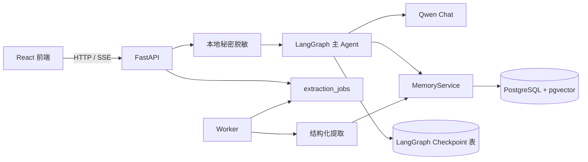
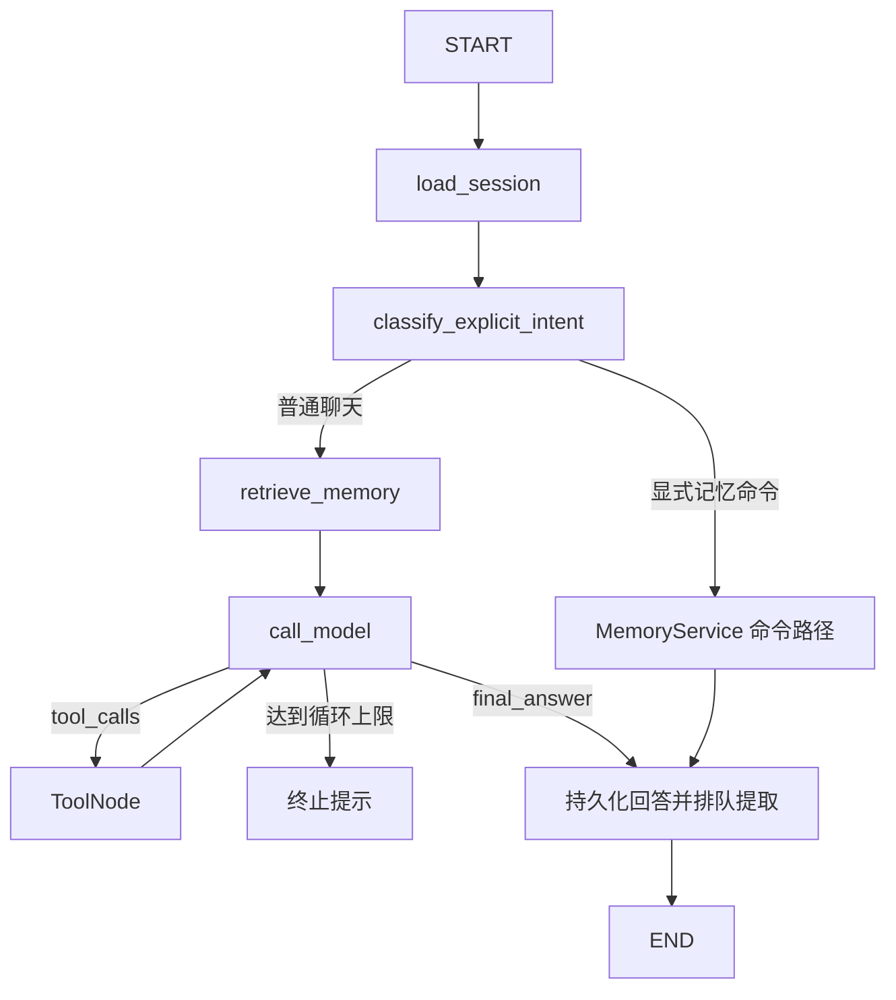
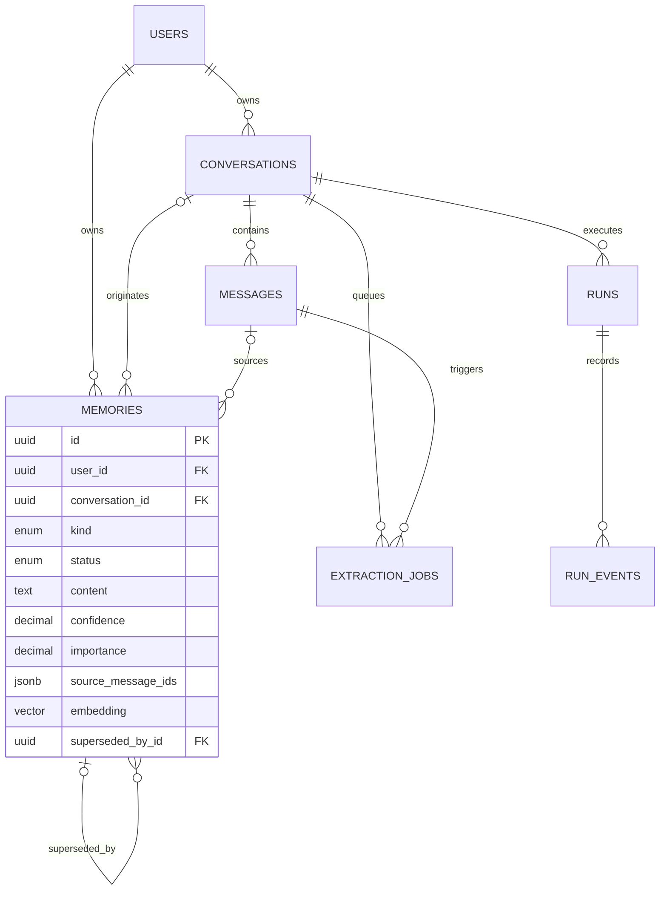

# 系统架构

## 请求与任务边界



业务表与 LangGraph Checkpoint 分离。业务表服务于产品查询、审计和评测；Checkpoint 只保存图状态，以 `conversation_id` 作为 `thread_id`。Checkpoint 不替代消息、运行和记忆记录。

普通聊天先写入脱敏后的用户消息和运行记录，再进入 Graph。主回答完成后创建持久化提取任务，SSE 不等待第二次模型调用。Worker 通过 `FOR UPDATE SKIP LOCKED`、租约、幂等键和指数退避恢复任务；Embedding 失败会创建同类持久补偿任务，文本记忆仍可通过关键词、时间和重要度召回。

`run.completed` 只表示主回答完成，不表示异步记忆提取已经结束。助手消息通过 `run_id` 关联本轮运行；Worker 成功后追加 `memory.extraction_completed`，达到最终重试上限后追加 `memory.extraction_failed`。前端以 `run_id + sequence` 增量获取并去重，切换会话时取消旧跟随；刷新页面时会从会话历史恢复完整运行事件，并继续跟随尚未产生终态事件的提取任务。

## Graph 状态图



Graph 只负责编排。会话、召回和工具所需的数据库访问由服务层准备或通过受控工具注入。三个工具分别是 `search_memory`、`get_user_timeline` 和 `propose_memory_update`；最后一个工具只能创建 `pending` 建议，不能绕过治理直接激活记忆。

## 数据模型



记忆冲突不会静默覆盖。新候选先进入 `pending` 并记录 `conflicts_with`；用户确认时旧记录才变为 `superseded`。撤销确认会成对恢复旧版本。重复证据合并到 `source_message_ids`，避免为同一事实创建重复记忆。

## 召回评分

```text
final_score =
  0.55 * vector
  + 0.20 * keyword
  + 0.10 * recency
  + 0.10 * importance
  + 0.05 * type_match
```

权重来自 `config.toml`，不是代码常量。PostgreSQL 先通过 `embedding <=> query_vector` 的近邻排序取得 HNSW 候选，再与近期候选合并，由纯函数计算五项得分。没有 Embedding 时向量权重退出并重新归一化，其余信号继续工作；各分项随 `memory.retrieved` 事件展示。

## 部署与安全

Compose 运行 `api`、`worker` 和 `postgres`。线上演示必须设置独立的 `DASHSCOPE_API_KEY`、数据库和 `DEMO_SHARED_PASSWORD`，并保留输入长度、分钟限流和每日 Token 预算。单进程内存限流只适用于单副本演示，多副本需要外部共享限流存储。

`GET /health` 会真实执行数据库查询；`GET /config` 只返回模型名、阈值和连接布尔状态。备份、恢复、预置演示数据和清空脚本位于 `scripts/`；清空数据同时处理业务表和 Checkpoint 表。
